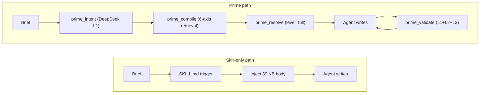

# Prime vs. the Skill-Graph Moment

*A field report on knowledge protocols for LLM agents — May 2026*

## TL;DR

Prime is a knowledge protocol: a typed DSL with 28 atom kinds, 14 edge verbs, a five-layer compile/retrieve/compose/generate/validate pipeline, three projection levels, and a 5-tool MCP surface. It is **not** another skill graph — it is the layer underneath one, the layer that lets a "skill" be a 30-line orchestration over a registry of typed atoms instead of a 200-line prose dump. If your agents already feel skill-overloaded — context bloat, drifting style, prompt rot, no way to enforce constraints across skills — you are in Prime's audience.

## 1. The skill-graph moment

The last twelve months turned "agent skill" from an Anthropic product feature into a movement. **anthropics/skills** ships 17 official skills and a `SKILL.md` whose entire frontmatter is two fields, `name` and `description` ([docs](https://platform.claude.com/docs/en/agents-and-tools/agent-skills/overview)). **VoltAgent/awesome-agent-skills** curates **1,100+** skills across Claude, Codex, Cursor, Gemini CLI, and Antigravity ([repo](https://github.com/VoltAgent/awesome-agent-skills)). **obra/superpowers** packages a 15-skill TDD methodology now in Anthropic's plugin marketplace ([repo](https://github.com/obra/superpowers); [Simon Willison](https://simonwillison.net/2025/Oct/10/superpowers/)). Aggregator marketplaces — SkillsMP, agentskills.io, Pawgrammer, claudemarketplaces — list anywhere from 281 curated to 900,000+ raw skills. The **AGENTS.md** standard, stewarded by the Agentic AI Foundation under the Linux Foundation, is read natively by Codex, Cursor, Copilot, Gemini CLI, Windsurf, and Factory ([agents.md](https://agents.md/)).

That breadth produced the first generation of *graphs* over skills:

- **GraSP — Graph-Structured Skill Compositions** (Tencent, Apr 2026): turns retrieved skills into a typed DAG with state, data, and order edges; pre/postcondition checks at each node; five-operator repair algebra. +19 reward, –41% steps vs ReAct/Reflexion/ExpeL on ALFWorld, ScienceWorld, WebShop, InterCode ([arXiv 2604.17870](https://arxiv.org/html/2604.17870v1)).
- **GoS — Graph of Skills** (Liu et al., Apr 2026): offline executable skill graph plus reverse-weighted Personalized PageRank at inference. +43.6% reward, –37.8% input tokens across Claude Sonnet, GPT-5.2 Codex, and MiniMax ([arXiv 2604.05333](https://arxiv.org/html/2604.05333)).
- **SoK: Agentic Skills — Beyond Tool Use** (Jiang et al., Feb 2026): names a seven-stage skill lifecycle and lands the year's most useful number — **curated skills lift agent pass rate by 16.2 pp; self-generated skills *degrade* it by 1.3 pp** ([arXiv 2602.20867](https://arxiv.org/html/2602.20867v1)).
- **Agent Skills for LLMs** (Xu & Yan, Feb 2026): the first audit-style survey. **26.1% of community-contributed skills contain vulnerabilities** ([arXiv 2602.12430](https://arxiv.org/abs/2602.12430)).
- **Voyager** (Wang et al., 2023): the genre's origin — an ever-growing executable skill library for Minecraft, GPT-4 + iterative self-verification ([arXiv 2305.16291](https://arxiv.org/abs/2305.16291)).
- **AGNTCY Directory + OASF**: a distributed agent directory whose Open Agentic Schema Framework defines a *hierarchical* skill taxonomy with DHT-routed records ([docs](https://docs.agntcy.org/dir/overview/)).
- **Letta**: memory blocks and skills as git-committed `.md` files with tool-rules acting like graph constraints ([Letta blog](https://www.letta.com/blog/skill-learning)).
- **Stacklok ToolHive**, **Vercel skills.io**, **JFrog Agent Skills repository**: enterprise registries treating namespacing, version pinning, and vulnerability scanning as first-class. JFrog's [explainer](https://jfrog.com/learn/ai-security/agent-skills-repository/) is the most honest about what is missing.

A comparison table is uncomfortable but useful:

| Project | Atomicity | Edges / verbs | Projection levels | Composition contract | Cross-domain | Lifecycle | Validation |
|---|---|---|---|---|---|---|---|
| anthropics/skills | skill = file | none | metadata / body / asset (3) | none | none | none | none |
| obra/superpowers | skill = file, mandatory ordering | implicit sequence | 2 | implicit | none | manual | manual |
| VoltAgent collection | skill = file | none | inherited | none | none | none | none |
| AGENTS.md | doc = file | none | 1 | none | none | none | none |
| AGNTCY/OASF | agent = record | hierarchical taxonomy | n/a | none | yes (records) | partial | DHT integrity |
| Letta | block + skill | tool-rules | core / recall (2) | none | yes | git history | none |
| Composio | tool = function | none (auth/scopes) | n/a | none | yes | semver | runtime sandboxing |
| GraSP | skill = node | state / data / order | runtime DAG | precondition / postcondition | task-bound | repair operators | per-node verification |
| GoS | skill = node | dependency / workflow / semantic / alternative | hydration budget | none | yes | offline build | semantic-lexical |
| Voyager | skill = code | none (curriculum) | code / metadata | self-verification | no (Minecraft only) | curriculum | runtime check |
| **Prime v1** | **atom (28 kinds)** | **14 verbs** | **summary / core / full** | **must-include / must-avoid / typography-required / color-required** | **2 domains, same DSL** | **version field + `deprecated` flag** | **L1 syntax + L2 LLM semantic + L3 cross-atom + L5 output** |

## 2. What everyone gets right

Three convictions have converged. Prime shares them.

**Atoms beat dumps.** Loading a 39 KB SKILL.md to answer a styling question is a category error. Anthropic's own docs frame "progressive disclosure" as a three-level loading model; Voyager built on it years ago; GoS's 37.8% input-token reduction comes from refusing to hydrate the bundle until edges have been walked. Prime ships an `_index.xml` of ~3 KB plus three projection levels (`summary` ~30 tok, `core` ~150 tok, `full` ~380 tok) addressed by stable atom IDs. The insight: *existence ≠ content*.

**Edges beat bullets.** The older skill-list wisdom — one big markdown, agent figures it out — fails at orchestration. GraSP states it cleanly: "the bottleneck has shifted from skill availability to skill orchestration." GoS proves the dual: dependency-aware retrieval beats pure semantic retrieval because "semantic proximity does not imply executable sufficiency." Prime's 3,096 edges over 739 atoms (with `requires`, `enhances`, `validates-with`, `conflicts`, `specializes`, `supplies-to`, `extends`, `derived-from`, `compatible`, `contradicts`, `see-also`, `related`, `includes`, `relationships`) is the same insight, made authoring-time and writable.

**Curated beats self-generated, today.** SoK's headline — curated +16.2 pp, self-generated –1.3 pp — is a license to *not* spend the next twelve months on autonomous skill discovery. The leverage now is the protocol layer: typed format, registry, validator. Voyager works in Minecraft because the environment is the verifier. Real domains lack that, which is why a Prime-style validator at Haiku prices ($0.0001/atom) is economically reasonable for the first time.

## 3. What everyone is still missing

**Composition contracts.** No public skill format lets an author say "if you load *me*, you must also load X and may not load Y." The official `SKILL.md` frontmatter is `name` and `description`. Period. (A Chinese-language blog circulating in Q1 2026 claimed Anthropic added a `depends_on` field; the official documentation contains no such field — readers have been chasing a phantom.) GraSP encodes pre/postconditions on nodes, but those are runtime-only and task-bound. Prime's `composition: { must-include, must-avoid, typography-required, color-required }` block, declared inside the persona atom and enforced at L3, is the assertion the ecosystem has not yet committed to a file.

**Projection levels as a first-class concept.** Anthropic's docs describe three levels of loading; the spec only defines metadata + body. Everything else is "the agent will read further files via bash if it feels like it." GoS has hydration budgets but no per-atom multi-level projection. Prime's `summary | core | full` is the difference between *an agent that decides what to look up* and *an agent that decides what level of detail to look up*. The chunker-bug story in PHILOSOPHY is the cautionary tale: when projection silently returned stubs, A/B benchmarks looked like Prime had no edge — even though the architecture was fine. Architecture without an honest projection contract is invisible.

**A semantic validation loop.** L2 — small-model per-atom semantic checks — is the new compiler primitive. It catches the bug class no one else can: a `claim:` that says "always", an `applies_when:` that says "mobile only", a `numeric:` block whose `>=` flips against the claim's "below". The SoK survey lists "verified autonomous skill generation" and "formal verification across representations" as open challenges; both presuppose a verifier. Haiku-priced semantic verification is that verifier — Prime treats it as a build-time obligation, not a wishlist item.

**Edge verb taxonomy with intent.** GraSP's three edge types (state, data, order) are runtime-sufficient but authoring-sparse. Prime's 14 verbs distinguish `enhances` (soft) from `requires` (hard) from `validates-with` (witness) from `supplies-to` (provider). Without the distinction every dependency collapses into "needs this to work" and you lose the ability to say "this rule is *witnessed* by WCAG 2.2 §1.4.3 but not derived from it." Authoring intent matters because every edge that gets compiled has to survive the next refactor.

**A decoupled runtime API.** Anthropic's Skills are coupled to Claude's filesystem-and-bash environment; Composio assumes LangChain/LlamaIndex; AGNTCY's directory is discovery, not authoring. Prime ships five MCP tools — `prime_compile`, `prime_query`, `prime_intent`, `prime_validate`, `prime_resolve` — that are model- and runtime-agnostic. `prime_resolve(id, level)` returning typed JSON is v1's most important milestone: the agent receives `{ implies: { font: { display: ["Fraunces", ...] } } }`, not a markdown stub it has to parse.



The skill path is single-shot inject. The Prime path is browse-then-fetch with a closing validation loop.

## 4. Where Prime is wrong / weaker

PHILOSOPHY commits to honesty about itself, so:

**One corpus today.** Frontend design (~410 atoms) and security (~32 atoms) share `primes-v3/sources/`. Domain isolation is metadata, not a namespace boundary. The Domain Plugin Protocol is on the v1.1 list.

**One language.** The `.prime` DSL is hand-written TypeScript — no second implementation, no formal BNF/EBNF artifact, no language server. If it is to become a community DSL, that has to change.

**No GPU-accelerated retrieval.** Multi-axis ranking is CPU-only token overlap + topic synonyms + kind boosts. Fast, deterministic, explainable — but not embedding-based, and untested past ~1,000 atoms.

**Cross-LLM portability is unverified at scale.** Every A/B benchmark (4-task, 8-task, 12-task) has run on `claude-opus-4-7[1m]`. "Designed to be portable" and "verified to be portable" are different sentences. GoS evaluated across Claude / GPT-5.2 / MiniMax — that is the bar.

**No registry yet.** `prime install @third-party/atoms` does not exist. v1 distributes atoms as source files; cross-team sharing is git submodule or copy-paste. The `version` field is in every atom; the registry that consumes it is not.

**L2 / L3 are partially cached, not CI-enforced.** The compiler can run them; the build pipeline does not gate on them. A `deprecated` atom does not yet trigger a retrieval-time warning.

The README says the protocol is ~70% implemented. We hold to that.

## 5. Pain points still unsolved across the ecosystem

**N=1 evaluations.** Most "my skill works" claims are anecdotal. SkillsBench is progress, but only GraSP and GoS report across multiple backbones; SoK is the one stake in the ground (16.2 pp). Everyone else compares their skill to *no* skill.

**Skill rot.** Anthropic's docs themselves warn that "even trustworthy skills can be compromised if their external dependencies change over time." That is rot, and there is no community story for it. Prime's `validates-with @w3c/wcag-2.2-1.4.3` makes the citation auditable — but nobody re-checks it at week 12.

**Prompt drift / distributional collapse.** Our 12-task A/B found that when the **impeccable** skill was loaded in full for editorial briefs, it produced **Space Grotesk in 5 of 6 typography-led tasks** — across waitlist, blog, magazine-editorial, dense-pragmatist registers. Loading a skill in full overwrites the agent's own register sense with the skill's defaults. Prime's per-atom projection avoids this only because each persona's `implies.font.display` is a structured field, not a sentence buried on line 117. Any skill format that ships defaults will see those defaults colonize unrelated tasks. The fix is structural, not editorial.

**Context rot.** Chroma's July 2025 [Context Rot](https://research.trychroma.com/context-rot) study tested 18 frontier models and found *every single one* degrades as input length grows — at every increment. This is why Prime's "Skill-in-full + critique" benchmark scored **13 points worse** than no skill at all. The problem was never that Skills don't help; loading them in full *interferes* with the model's own judgement.

## 6. What good looks like in 2026

A community-grade knowledge protocol — built by Anthropic, AGNTCY, Letta, the SoK authors, or some combination — should have at minimum: a typed atom format covering data, behavior, composition, style, and meta layers; a small but disciplined edge-verb set distinguishing `requires` / `enhances` / `validates-with` / `supplies-to` / `conflicts` / `specializes`; multi-level projection (at least summary and full) addressed by stable IDs; a composition contract on persona-like atoms with `must-include` and `must-avoid` honored by a runtime validator; a small-LLM-priced semantic check pipeline run at build time and cached on content hash; a registry with semver pinning, deprecation warnings, and namespace isolation; a model-agnostic API returning typed JSON, not prose; and a validation loop the agent can call after generation that returns structured feedback for retry.

Prime hits seven of those eight in v1; the registry is the gap. None of the surveyed projects hits more than four.

## 7. How to convert a Skill to Prime atoms today

A reference workflow lives in `release/skills/prime-decompose/` (Track A, in progress). The shape:

```prime
persona Airbnb {
  id: "@community/persona-airbnb"
  version: "1.0.0"
  school: airbnb
  domain: visual-design

  description: "Warm photography-forward marketplace aesthetic..."

  implies: {
    font: {
      display: "Airbnb Cereal VF (fallbacks: Circular, -apple-system, system-ui)"
      body: "Airbnb Cereal VF same family; 14px / 400 / line-height 1.43"
    }
    color: {
      palette: "Rausch Red #ff385c brand accent..., warm near-black #222222 primary text"
    }
    density: "open — 20px card radius, 32px large container"
  }

  compatible: ["magazine-editorial", "warm-institutional", "notion-warm"]
  conflicts:  ["vercel-clean", "dense-pragmatist", "brutalist"]

  composition: {
    must-include: [
      @community/principle-vertical-rhythm,
      @impeccable/template-card-hover-lift,
    ]
    must-avoid: [
      @impeccable/persona-dense-pragmatist,
      @community/anti-pattern-thin-weight-body,
    ]
  }
}
```

That single atom does the work of two pages of `frontend-design/SKILL.md` prose, with three properties the prose cannot express: a `composition.must-include` set that L3 verifies before agent generation; mutex with three peer personas, making them non-loadable in the same context; and `implies.font.display` as a *structured* value the agent reads, not a sentence to parse.

The decompose tooling reads a SKILL.md, extracts candidate atoms by paragraph, suggests reuses against the existing corpus, and emits a 30-line orchestration that imports atoms instead of inlining prose. The compression on the impeccable critique skill was ~5× on context (412 tokens vs. 2,100), with quality matched by AI-judge scoring.

## 8. References

- Anthropic — [Agent Skills overview](https://platform.claude.com/docs/en/agents-and-tools/agent-skills/overview), [Equipping agents (Oct 2025)](https://www.anthropic.com/engineering/equipping-agents-for-the-real-world-with-agent-skills), [anthropics/skills](https://github.com/anthropics/skills)
- [obra/superpowers](https://github.com/obra/superpowers); [Simon Willison's Superpowers writeup](https://simonwillison.net/2025/Oct/10/superpowers/); [simonw/claude-skills](https://github.com/simonw/claude-skills)
- [VoltAgent/awesome-agent-skills (1,100+)](https://github.com/VoltAgent/awesome-agent-skills); [travisvn/awesome-claude-skills](https://github.com/travisvn/awesome-claude-skills); [karanb192/awesome-claude-skills](https://github.com/karanb192/awesome-claude-skills)
- [agents.md](https://agents.md/); [AGNTCY Directory + OASF](https://docs.agntcy.org/dir/overview/); [Letta — Skill Learning](https://www.letta.com/blog/skill-learning); [Hugging Face smolagents Skills discussion](https://github.com/huggingface/smolagents/discussions/1947)
- GraSP — [arXiv 2604.17870](https://arxiv.org/html/2604.17870v1); GoS — [arXiv 2604.05333](https://arxiv.org/html/2604.05333); SoK Agentic Skills — [arXiv 2602.20867](https://arxiv.org/html/2602.20867v1); Xu & Yan survey — [arXiv 2602.12430](https://arxiv.org/abs/2602.12430); SkillRL — [HF 2602.08234](https://huggingface.co/papers/2602.08234); AutoSkill — [arXiv 2603.01145](https://arxiv.org/abs/2603.01145); Voyager — [arXiv 2305.16291](https://arxiv.org/abs/2305.16291)
- [Chroma — Context Rot (Jul 2025)](https://research.trychroma.com/context-rot); [GAIA benchmark](https://arxiv.org/abs/2311.12983); [JFrog Agent Skills explainer](https://jfrog.com/learn/ai-security/agent-skills-repository/); [Stacklok ToolHive](https://docs.stacklok.com/toolhive/updates/2026/04/06/updates); [W3C DTCG first stable spec](https://www.w3.org/community/design-tokens/2025/10/28/design-tokens-specification-reaches-first-stable-version/)
- Prime: [PHILOSOPHY.md](../../PHILOSOPHY.md), [PRIME-SPEC-v1.md](../../PRIME-SPEC-v1.md), [PRIME-VS-SKILLS.md](../../PRIME-VS-SKILLS.md)
