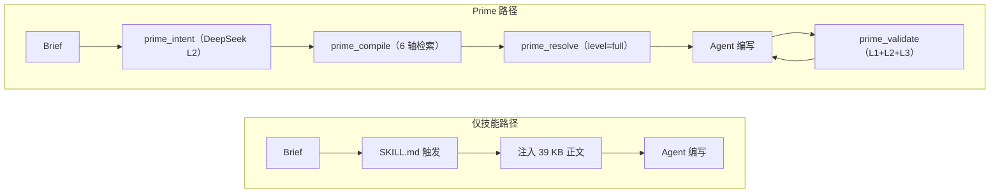

# Prime vs. 技能图时代

*LLM agent 知识协议现场报告——2026 年 5 月*

## 核心观点

Prime 是一个知识协议：类型化 DSL、28 种原子类型、14 种边动词、五层编译/检索/组合/生成/验证流水线、三级投影层次和 5 工具 MCP 接口。它**不是**另一个技能图——而是技能图的底层，让一个"skill"变成对类型化原子注册中心的 30 行编排，而非 200 行散文堆砌。如果你的 agent 已经深感技能过载——上下文膨胀、风格漂移、提示词腐化、无法跨技能强制约束——那你正是 Prime 的目标受众。

## 1. 技能图时代

过去 12 个月，"agent skill"从 Anthropic 的产品功能演变为一场运动。**anthropics/skills** 收录 17 个官方技能，`SKILL.md` 的元数据仅有 `name` 和 `description` 两个字段（[文档](https://platform.claude.com/docs/en/agents-and-tools/agent-skills/overview)）。**VoltAgent/awesome-agent-skills** 汇聚了 Claude、Codex、Cursor、Gemini CLI 和 Antigravity 的 **1,100+ 个**技能（[仓库](https://github.com/VoltAgent/awesome-agent-skills)）。**obra/superpowers** 打包了一套 15 技能的 TDD 方法论，现已入驻 Anthropic 插件市场（[仓库](https://github.com/obra/superpowers)；[Simon Willison](https://simonwillison.net/2025/Oct/10/superpowers/)）。聚合市场——SkillsMP、agentskills.io、Pawgrammer、claudemarketplaces——列出从 281 个精选到 900,000+ 个原始技能不等。由 Linux 基金会下属 Agentic AI Foundation 管理的 **AGENTS.md** 标准，已被 Codex、Cursor、Copilot、Gemini CLI、Windsurf 和 Factory 原生支持（[agents.md](https://agents.md/)）。

这种广度催生了第一代技能*图*：

- **GraSP——图结构技能组合**（腾讯，2026 年 4 月）：将检索到的技能组织为带状态、数据和顺序边的类型化 DAG；每个节点有前/后置条件检查；五算符修复代数。在 ALFWorld、ScienceWorld、WebShop、InterCode 上相对 ReAct/Reflexion/ExpeL 奖励 +19、步数 –41%（[arXiv 2604.17870](https://arxiv.org/html/2604.17870v1)）。
- **GoS——技能图**（Liu 等，2026 年 4 月）：离线可执行技能图 + 推理时反向加权个性化 PageRank。跨 Claude Sonnet、GPT-5.2 Codex 和 MiniMax 奖励 +43.6%、输入 token –37.8%（[arXiv 2604.05333](https://arxiv.org/html/2604.05333)）。
- **SoK：Agentic Skills——超越工具使用**（Jiang 等，2026 年 2 月）：提出七阶段技能生命周期，并给出今年最有价值的数字——**精选技能将 agent 通过率提升 16.2 个百分点；自生成技能则*降低* 1.3 个百分点**（[arXiv 2602.20867](https://arxiv.org/html/2602.20867v1)）。
- **LLM 的 Agent 技能**（Xu & Yan，2026 年 2 月）：首个审计式调查。**26.1% 的社区贡献技能存在漏洞**（[arXiv 2602.12430](https://arxiv.org/abs/2602.12430)）。
- **Voyager**（Wang 等，2023）：该领域的起源——一个用于 Minecraft 的持续扩展可执行技能库，GPT-4 + 迭代自验证（[arXiv 2305.16291](https://arxiv.org/abs/2305.16291)）。
- **AGNTCY Directory + OASF**：分布式 agent 目录，其 Open Agentic Schema Framework 定义了带 DHT 路由记录的*层次化*技能分类法（[文档](https://docs.agntcy.org/dir/overview/)）。
- **Letta**：内存块和技能作为 git 提交的 `.md` 文件，工具规则充当图约束（[Letta 博客](https://www.letta.com/blog/skill-learning)）。
- **Stacklok ToolHive**、**Vercel skills.io**、**JFrog Agent Skills repository**：将命名空间、版本固定和漏洞扫描作为头等公民的企业注册中心。JFrog 的[说明](https://jfrog.com/learn/ai-security/agent-skills-repository/)最诚实地指出了尚缺少的东西。

对比表令人不舒服，但很有价值：

| 项目 | 原子性 | 边 / 动词 | 投影层级 | 组合约束 | 跨领域 | 生命周期 | 验证 |
|---|---|---|---|---|---|---|---|
| anthropics/skills | skill = 文件 | 无 | 元数据 / 正文 / 资产（3） | 无 | 无 | 无 | 无 |
| obra/superpowers | skill = 文件，强制顺序 | 隐式序列 | 2 | 隐式 | 无 | 手动 | 手动 |
| VoltAgent 集合 | skill = 文件 | 无 | 继承 | 无 | 无 | 无 | 无 |
| AGENTS.md | doc = 文件 | 无 | 1 | 无 | 无 | 无 | 无 |
| AGNTCY/OASF | agent = 记录 | 层次分类法 | n/a | 无 | 是（记录） | 部分 | DHT 完整性 |
| Letta | 块 + 技能 | 工具规则 | core / recall（2） | 无 | 是 | git 历史 | 无 |
| Composio | tool = 函数 | 无（auth/scopes） | n/a | 无 | 是 | semver | 运行时沙箱 |
| GraSP | skill = 节点 | 状态 / 数据 / 顺序 | 运行时 DAG | 前/后置条件 | 任务绑定 | 修复算符 | 逐节点验证 |
| GoS | skill = 节点 | 依赖 / 工作流 / 语义 / 替代 | 水化预算 | 无 | 是 | 离线构建 | 语义-词法 |
| Voyager | skill = 代码 | 无（课程） | 代码 / 元数据 | 自验证 | 否（仅 Minecraft） | 课程 | 运行时检查 |
| **Prime v1** | **原子（28 种类型）** | **14 种动词** | **summary / core / full** | **must-include / must-avoid / typography-required / color-required** | **2 个领域，同一 DSL** | **version 字段 + `deprecated` 标志** | **L1 语法 + L2 LLM 语义 + L3 跨原子 + L5 输出** |

## 2. 大家都做对了什么

三个共识已经形成，Prime 与之共鸣。

**原子优于倾倒。** 加载 39 KB 的 SKILL.md 来回答一个样式问题是概念错误。Anthropic 自己的文档将"渐进式披露"定义为三级加载模型；Voyager 几年前就建立在此基础上；GoS 的 37.8% 输入 token 减少，正是来自拒绝在遍历边之前水化整个包。Prime 提供约 3 KB 的 `_index.xml` 和三级投影（`summary` ~30 token、`core` ~150 token、`full` ~380 token），通过稳定的原子 ID 寻址。核心洞察：*存在 ≠ 内容*。

**边优于项目符号。** 旧式技能列表的智慧——一个大 Markdown，让 agent 自己搞定——在编排层面失效。GraSP 清晰地表达了这一点："瓶颈已从技能可用性转移到技能编排。"GoS 证明了逆命题：依赖感知检索优于纯语义检索，因为"语义接近不意味着可执行充分性。"Prime 在 739 个原子上建立的 3,096 条边（`requires`、`enhances`、`validates-with`、`conflicts`、`specializes`、`supplies-to`、`extends`、`derived-from`、`compatible`、`contradicts`、`see-also`、`related`、`includes`、`relationships`）体现的是同一洞察——写在编写时，可读写。

**精选优于自生成（当下）。** SoK 的头条数字——精选 +16.2 pp，自生成 –1.3 pp——是一张许可证，允许我们在接下来 12 个月*不*把精力押在自主技能发现上。当下的杠杆在协议层：类型化格式、注册中心、验证器。Voyager 在 Minecraft 中有效，是因为环境本身就是验证者。真实领域缺乏这个条件，这正是为什么 Haiku 定价（$0.0001/原子）的 Prime 式验证器在经济上首次可行。

## 3. 大家还缺少什么

**组合约束。** 没有任何公开的技能格式允许作者说"如果你加载了*我*，你也必须加载 X，而且不能加载 Y。"官方 `SKILL.md` 元数据只有 `name` 和 `description`。句号。（2026 年 Q1 流传的一篇中文博文声称 Anthropic 添加了 `depends_on` 字段；官方文档中没有此字段——读者一直在追逐幻影。）GraSP 在节点上编码前/后置条件，但那些是仅在运行时有效且与任务绑定的。Prime 在 persona 原子内部声明、在 L3 强制执行的 `composition: { must-include, must-avoid, typography-required, color-required }` 块，是整个生态系统尚未在文件中落地的断言。

**投影层级作为头等概念。** Anthropic 文档描述了三级加载；规范只定义了元数据 + 正文。其余全靠"agent 如果觉得有必要会通过 bash 读取更多文件。"GoS 有水化预算，但没有逐原子多级投影。Prime 的 `summary | core | full` 区别的是*决定查什么的 agent* 和*决定查什么详细程度的 agent*。PHILOSOPHY 中的分块器 Bug 故事是前车之鉴：当投影静默返回存根时，A/B 基准测试看起来 Prime 毫无优势——即使架构本身是正确的。没有诚实投影合约的架构是隐形的。

**语义验证循环。** L2——小模型逐原子语义检查——是新的编译器基础设施。它捕捉了其他人都无法捕捉的 Bug 类型：`claim:` 说"始终"，而 `applies_when:` 说"仅限移动端"；`numeric:` 块的 `>=` 与断言中的"低于"相悖。SoK 调查将"经验证的自主技能生成"和"跨表示的形式化验证"列为开放挑战；两者都预设了一个验证器。Haiku 定价的语义验证就是这个验证器——Prime 将其视为构建时义务，而非愿望清单条目。

**有意图的边动词分类法。** GraSP 的三种边类型（状态、数据、顺序）在运行时足够，但在编写时稀疏。Prime 的 14 种动词区分了 `enhances`（软）与 `requires`（硬）、`validates-with`（见证）与 `supplies-to`（提供者）。没有这种区分，每个依赖都退化为"需要这个才能工作"，你就失去了表达"这条规则*由* WCAG 2.2 §1.4.3 见证，而非源自它"的能力。编写意图很重要，因为每条编译入库的边都必须在下次重构中存活。

**解耦的运行时 API。** Anthropic 的 Skills 与 Claude 的文件系统加 bash 环境耦合；Composio 假设 LangChain/LlamaIndex；AGNTCY 目录是发现，而非编写。Prime 提供五个 MCP 工具——`prime_compile`、`prime_query`、`prime_intent`、`prime_validate`、`prime_resolve`——模型无关、运行时无关。`prime_resolve(id, level)` 返回类型化 JSON 是 v1 最重要的里程碑：agent 收到的是 `{ implies: { font: { display: ["Fraunces", ...] } } }`，而非需要解析的 Markdown 存根。



技能路径是单次注入。Prime 路径是浏览后取用，附带闭合验证循环。

## 4. Prime 的不足与弱点

PHILOSOPHY 承诺对自身诚实：

**目前只有一个语料库。** 前端设计（约 410 个原子）和安全（约 32 个原子）共享 `primes-v3/sources/`。领域隔离是元数据，而非命名空间边界。领域插件协议列入 v1.1 计划。

**只有一种语言实现。** `.prime` DSL 是手写的 TypeScript——没有第二实现，没有正式 BNF/EBNF，没有语言服务器。若要成为社区 DSL，这必须改变。

**没有 GPU 加速检索。** 多轴排序是纯 CPU 的 token 重叠 + 主题同义词 + 类型提升。快速、确定性、可解释——但不基于嵌入，也未在超过约 1,000 个原子的规模下测试。

**跨 LLM 可移植性尚未规模验证。** 每个 A/B 基准（4 任务、8 任务、12 任务）都在 `claude-opus-4-7[1m]` 上运行。"设计上可移植"和"验证上可移植"是两句不同的话。GoS 跨 Claude / GPT-5.2 / MiniMax 进行了评估——那才是标杆。

**还没有注册中心。** `prime install @third-party/atoms` 不存在。v1 以源文件分发原子；跨团队共享靠 git 子模块或复制粘贴。`version` 字段在每个原子中都有；消费它的注册中心还没有。

**L2 / L3 部分缓存，未 CI 强制执行。** 编译器可以运行它们；构建流水线不以它们为门控。`deprecated` 原子目前不会在检索时触发警告。

README 说协议约 70% 已实现，我们坚持这个数字。

## 5. 整个生态系统尚未解决的痛点

**N=1 评估。** 大多数"我的技能有效"的声明是轶事。SkillsBench 是进展，但只有 GraSP 和 GoS 跨多个骨干模型报告；SoK 是唯一的基准桩（16.2 pp）。其他人都在将自己的技能与*没有*技能的情况比较。

**技能腐化。** Anthropic 的文档本身警告"即使是值得信任的技能，如果其外部依赖项随时间变化，也可能被破坏。"那就是腐化，而社区对此没有应对方案。Prime 的 `validates-with @w3c/wcag-2.2-1.4.3` 使引用可审计——但没有人在第 12 周重新检查它。

**提示词漂移 / 分布坍缩。** 我们的 12 任务 A/B 发现，当 **impeccable** 技能以完整形式加载用于编辑类 brief 时，在 6 个以字体为主导的任务中，**5 个输出了 Space Grotesk**——横跨 waitlist、blog、magazine-editorial、dense-pragmatist 风格。以完整形式加载技能会用技能的默认值覆盖 agent 自身的风格感知。Prime 的逐原子投影只能避免这种情况，因为每个 persona 的 `implies.font.display` 是一个结构化字段，而不是埋在第 117 行的句子。任何随附默认值的技能格式都会看到这些默认值殖民不相关的任务。修复是结构性的，不是编辑性的。

**上下文腐化。** Chroma 2025 年 7 月的[上下文腐化](https://research.trychroma.com/context-rot)研究测试了 18 个前沿模型，发现*每一个*都随着输入长度增长而退化——在每个增量上。这正是为什么 Prime 的"完整技能 + 批评"基准测试得分比完全不用技能**低 13 分**。问题从来不是 Skills 没有帮助；以完整形式加载它们会*干扰*模型自身的判断。

## 6. 2026 年好的样子

一个社区级知识协议——由 Anthropic、AGNTCY、Letta、SoK 作者或某种组合构建——至少应具备：覆盖数据、行为、组合、风格和元层的类型化原子格式；区分 `requires` / `enhances` / `validates-with` / `supplies-to` / `conflicts` / `specializes` 的小而自律的边动词集；至少两个层级（summary 和 full）通过稳定 ID 寻址的多级投影；类 persona 原子上的组合约束，`must-include` 和 `must-avoid` 由运行时验证器强制执行；在构建时运行、按内容哈希缓存的小型 LLM 定价语义检查流水线；带 semver 固定、废弃警告和命名空间隔离的注册中心；返回类型化 JSON 而非散文的模型无关 API；以及 agent 在生成后可调用、返回结构化重试反馈的验证循环。

Prime 在 v1 中实现了其中七项；注册中心是缺口。被调查的项目没有一个超过四项。

## 7. 今天如何将 Skill 转换为 Prime 原子

参考工作流位于 `release/skills/prime-decompose/`（Track A，进行中）。形式如下：

```prime
persona Airbnb {
  id: "@community/persona-airbnb"
  version: "1.0.0"
  school: airbnb
  domain: visual-design

  description: "温暖的摄影优先市场美学..."

  implies: {
    font: {
      display: "Airbnb Cereal VF（备用：Circular, -apple-system, system-ui）"
      body: "Airbnb Cereal VF 同族；14px / 400 / line-height 1.43"
    }
    color: {
      palette: "Rausch Red #ff385c 品牌强调色..., 温暖近黑 #222222 主文本"
    }
    density: "开阔——20px card 圆角，32px 大容器"
  }

  compatible: ["magazine-editorial", "warm-institutional", "notion-warm"]
  conflicts:  ["vercel-clean", "dense-pragmatist", "brutalist"]

  composition: {
    must-include: [
      @community/principle-vertical-rhythm,
      @impeccable/template-card-hover-lift,
    ]
    must-avoid: [
      @impeccable/persona-dense-pragmatist,
      @community/anti-pattern-thin-weight-body,
    ]
  }
}
```

这一个原子完成了两页 `frontend-design/SKILL.md` 散文的工作，并额外表达了三个散文无法表达的属性：L3 在 agent 生成前验证的 `composition.must-include` 集合；与三个同级 persona 的互斥关系，使它们无法在同一上下文中加载；以及 `implies.font.display` 作为 agent 读取的*结构化值*，而非需要解析的句子。

分解工具读取 SKILL.md，按段落提取候选原子，建议复用现有语料库中的内容，并输出 30 行编排代码，导入原子而非内联散文。impeccable 批评技能的压缩比约为 5×（412 token vs. 2,100），质量由 AI 评判评分持平。

## 8. 参考文献

- Anthropic — [Agent Skills 概览](https://platform.claude.com/docs/en/agents-and-tools/agent-skills/overview)、[装备 agent（2025 年 10 月）](https://www.anthropic.com/engineering/equipping-agents-for-the-real-world-with-agent-skills)、[anthropics/skills](https://github.com/anthropics/skills)
- [obra/superpowers](https://github.com/obra/superpowers)；[Simon Willison 的 Superpowers 评述](https://simonwillison.net/2025/Oct/10/superpowers/)；[simonw/claude-skills](https://github.com/simonw/claude-skills)
- [VoltAgent/awesome-agent-skills（1,100+）](https://github.com/VoltAgent/awesome-agent-skills)；[travisvn/awesome-claude-skills](https://github.com/travisvn/awesome-claude-skills)；[karanb192/awesome-claude-skills](https://github.com/karanb192/awesome-claude-skills)
- [agents.md](https://agents.md/)；[AGNTCY Directory + OASF](https://docs.agntcy.org/dir/overview/)；[Letta — 技能学习](https://www.letta.com/blog/skill-learning)；[Hugging Face smolagents 技能讨论](https://github.com/huggingface/smolagents/discussions/1947)
- GraSP — [arXiv 2604.17870](https://arxiv.org/html/2604.17870v1)；GoS — [arXiv 2604.05333](https://arxiv.org/html/2604.05333)；SoK Agentic Skills — [arXiv 2602.20867](https://arxiv.org/html/2602.20867v1)；Xu & Yan 调查 — [arXiv 2602.12430](https://arxiv.org/abs/2602.12430)；SkillRL — [HF 2602.08234](https://huggingface.co/papers/2602.08234)；AutoSkill — [arXiv 2603.01145](https://arxiv.org/abs/2603.01145)；Voyager — [arXiv 2305.16291](https://arxiv.org/abs/2305.16291)
- [Chroma — 上下文腐化（2025 年 7 月）](https://research.trychroma.com/context-rot)；[GAIA benchmark](https://arxiv.org/abs/2311.12983)；[JFrog Agent Skills 说明](https://jfrog.com/learn/ai-security/agent-skills-repository/)；[Stacklok ToolHive](https://docs.stacklok.com/toolhive/updates/2026/04/06/updates)；[W3C DTCG 首个稳定规范](https://www.w3.org/community/design-tokens/2025/10/28/design-tokens-specification-reaches-first-stable-version/)
- Prime：[PHILOSOPHY.md](../../PHILOSOPHY.md)、[PRIME-SPEC-v1.md](../../PRIME-SPEC-v1.md)、[PRIME-VS-SKILLS.md](../../PRIME-VS-SKILLS.md)
